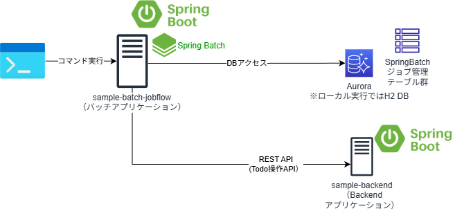

# SpringBootのジョブフローの純バッチアプリケーションサンプル

## 概要
* Spring BootでAWS Step Functionsを使って、ステートマシンをジョブの実行順序を管理するジョブフローとして実行する、バッチのサンプルAPである。
アプリケーションは、Spring Batchを使用しており、Step FunctionsのステートマシンからAWS Batchを利用して指定されたジョブIDとパラメータのジョブを実行するようになっている。

    * TODO: 実装イメージ

    

* 本サンプルAPのソフトウェアアーキテクチャの図は以下の通り。


## プロジェクト構成
* sample-batch-flow
    * 本プロジェクト。Spring Bootのバッチアプリケーションで、Step Functionsを介してジョブを処理することが可能である。    
        * デフォルトでは「spring.profiles.active」プロパティが「dev」になっている。プロファイルdevの場合は、RDB永続化にはH2DBによる組み込みDBになっている。
        * プロファイルproductionの場合は、RDB永続化にはPostgreSQL（AWS上はAurora等）になっている。

## 事前準備
* 以下のライブラリを用いているので、EclipseのようなIDEを利用する場合には、プラグインのインストールが必要
    * [Lombok](https://projectlombok.org/)
        * [Eclipseへのプラグインインストール](https://projectlombok.org/setup/eclipse)
        * [IntelliJへのプラグインインストール](https://projectlombok.org/setup/intellij)
    * [Mapstruct](https://mapstruct.org/)
        * [EclipseやIntelliJへのプラグインインストール](https://mapstruct.org/documentation/ide-support/)

## 動作手順

* TODO:今後記載予定


## PostgreSQLのローカル起動
* Profileが「dev」でSpringBootアプリケーションを実行する場合、H2DBが起動するので、何もしなくてよい。
* Profileが「production」に切り替えてSpringBootアプリケーションを実行する場合、DBがPostgreSQLで動作する設定になっているため、事前にPostgreSQLを起動する必要がある。
    * AWS上でAPを起動する場合はAurora for PostgreSQLや、RDS for PostgreSQLを起動しておくことを想定している。
* Profile「procution」でAPをローカル実行する場合は、AP起動前にあらかじめ、PostgreSQLをDockerで起動しローカル実行しておく必要がある。以下で、PostgreSQLのローカル実行手順を示す。
```sh
#Postgres SQLの起動
docker run --name test-postgres -p 5432:5432 -e POSTGRES_PASSWORD=password -d postgres
#Postgresのコンテナにシェルで入って、psqlコマンドで接続
docker exec -i -t test-postgres /bin/bash
> psql -U postgres

# psqlで、testdbデータベースを作成
postgres> CREATE DATABASE testdb;
```

## S3の設定
* Profileが「dev」でSpringBootアプリケーションを実行する場合、S3アクセスは無効化し、ローカルのファイルシステムアクセスする設定になっている。
    * application-dev.ymlの「example.s3.localfake.type」が「file」であり、「example.s3.localfake.base-dir」を一時保存するファイルシステムのディレクトリパスが現状、C:\tmpになっているので、フォルダの変更が必要な場合は、変更する。
        * 「sample-bff」アプリケーション側も変更が必要

> [!NOTE]
> MinIOは、GNU AGPL v3によるOSSライセンスと商用ライセンスのデュアルライセンスで提供されており、MinIOを同梱しての配布、利用等には注意すること。  
> また、現在、MinIOは、[Dockerイメージの配布を停止してしまった](https://github.com/minio/minio/issues/21647)ようなので、今後、コミュニティでの利用状況が悪化することも踏まえ、代替案としてLocalStackを利用する方法を整理した。これにより、他のAWSサービスのローカル実行もLocalStackで一元的に実行する手順も今後整備する。
> s3rverは、現在、アーカイブされているので、利用等には注意すること。

> [!NOTE]
> LocalStackの無料版では、CIクレジット（CI環境での実行）は含まれていないため、利用には注意すること。  
> また、[LocalStackの今後の展望](https://blog.localstack.cloud/the-road-ahead-for-localstack/)では、Community版とPro版を1つのDockerイメージに統合することや、無料版であっても、アカウント登録が必要になることがアナウンスされているため、今後の動向に注意すること。

* Profileが「dev」でも、S3のローカル起動用のFake（LocalStackやMinIO、s3rver）を起動したい場合には、以下の通り
    * LocalStackの場合
        * Docker起動が前提になるため、Dockerがインストールされている必要がある。
        * [LocalStackのサイト](https://docs.localstack.cloud/aws/getting-started/installation/)に記載された、いずれかの手順に従いインストールし、LocalStackを起動
            * ここでは[Docker Composeでの起動例](https://docs.localstack.cloud/aws/getting-started/installation/#docker-compose)を記載する。すでに、サンプルとしてlocalstackフォルダにdocker-compose.ymlが用意されているので、以下の通り起動する。

            ```sh
            cd localstack
            docker compose up -d
            ```

            ```sh
            $ aws configure --profile localstack
            AWS Access Key ID [None]: dummy
            AWS Secret Access Key [None]: dummy
            Default region name [None]: ap-northeast-1
            Default output format [None]: json
            ```
            
            * バケット作成
                * サンプルAPが起動時のにアクセスするS3のバケットを作成してくれるので通常は作成不要。
                * 明示的に作成する場合は、LocalStackが起動したら、AWS CLIでS3のバケットを作成する。

            ```sh
            aws s3 mb --endpoint-url=http://localhost:4566 --profile localstack s3://mysd33bucket123
            aws s3 ls --endpoint-url=http://localhost:4566 --profile localstack
            ```

            * バケット内のファイルの確認（サンプルAP実行後に使用）

            ```sh            
            aws s3 ls --endpoint-url=http://localhost:4566 --profile localstack s3://mysd33bucket123 --recursive
            ```

    * MinIOの場合
        * [MinIOのサイト](https://min.io/download#/windows)の手順に従い、インストールし、MinIOを起動
        * 以下は、Windows版での起動例
            * C:\minioフォルダにminio.exeを格納して、起動した例（デフォルトポート9000番ポートで起動、コンソールは9001番ポートで起動）

            ```sh        
            C:\minio\minio.exe server C:\minio\data --console-address ":9001"
            ```

        *  application-dev.ymlの「example.s3.localfake.type」を「minio」に変更し、以下の通り設定

            ```yaml
            example:
            s3:
                localfake:
                type: minio
                port: 9000
                access-key-id: minioadmin
                secret-access-key: minioadmin
                bucket: mysd33bucket123
            ```
    * s3rverの場合
        * [s3rverのサイト](https://github.com/jamhall/s3rver)の手順に従い、npmでインストールし、s3rverを起動

        * 以下、起動例

            ```
            s3rver -d C:\s3rver
            ```

        *  application-dev.ymlの「example.s3.localfake.type」を「s3rver」に変更し、以下の通り設定

            ```yaml
            example:
              s3:
                localfake:
                  type: s3rver
                  port: 4568
                bucket: mysd33bucket123
            ```

* Profileが「production」に切り替えてSpringBootアプリケーションを実行する場合、S3を使用する設定になっているため、事前にAWS上に、S3のバケットを作成する必要がある。
    * application-production.ymlの「aws.s3.bucket」プロパティを作成したバケット名に変更する。
    * APがS3にアクセスする権限が必要なので、開発端末上でローカル実行する場合はS3のアクセス権限をもったIAMユーザのクレデンシャル情報が「%USERPROFILE%/.aws/credentials」や「~/.aws/credentials」に格納されている、もしくはEC2やECS等のAWS上のラインタイム環境で実行する場合は対象のAWSリソースにSQSのアクセス権限を持ったIAMロールが付与されている必要がある。


## Dockerでのアプリ起動
* Mavenビルド
```sh
#Windows
.\mvnw.cmd package
#Linux/Mac
./mvnw package
```
* ローカルでDockerビルド
```sh
docker build -t XXXXXXXXXXXX.dkr.ecr.ap-northeast-1.amazonaws.com/sample-batch:latest .
```

* ローカルでDocker実行（Profileを「dev」でSpringBoot実行）
```sh
docker run -d -p 8001:8001 --name samplebatch --env SPRING_PROFILES_ACTIVE=dev,log_default --env SERVER_PORT=8001 --env SPRING_DATASOURCE_URL=jdbc:postgresql://host.docker.internal:5432/testdb --env API_BACKEND_URL=http://host.docker.internal:8000 XXXXXXXXXXXX.dkr.ecr.ap-northeast-1.amazonaws.com/sample-batch:latest

#logをjson形式に変更する場合
docker run -d -p 8001:8001 --name samplebatch --env SPRING_PROFILES_ACTIVE=dev,log_container --env SERVER_PORT=8001 --env SPRING_DATASOURCE_URL=jdbc:postgresql://host.docker.internal:5432/testdb --env API_BACKEND_URL=http://host.docker.internal:8000 XXXXXXXXXXXX.dkr.ecr.ap-northeast-1.amazonaws.com/sample-batch:latest
```

* ローカルでDocker実行（Profileを「production」でSpringBoot実行）　
    * ※Redisのローカル起動、PostgreSQLのローカル起動も必要
```sh
docker run -d -p 8001:8001 -v %USERPROFILE%\.aws\:/home/app/.aws/ --name samplebatch --env SPRING_PROFILES_ACTIVE=production,log_default --env SERVER_PORT=8001 --env API_BACKEND_URL=http://host.docker.internal:8000 --env SPRING_DATASOURCE_URL=jdbc:postgresql://host.docker.internal:5432/testdb XXXXXXXXXXXX.dkr.ecr.ap-northeast-1.amazonaws.com/sample-batch:latest

#logをjson形式に変更する場合
docker run -d -p 8001:8001 -v %USERPROFILE%\.aws\:/home/app/.aws/ --name samplebatch --env SPRING_PROFILES_ACTIVE=production,log_container --env SERVER_PORT=8001 --env API_BACKEND_URL=http://host.docker.internal:8000 --env SPRING_DATASOURCE_URL=jdbc:postgresql://host.docker.internal:5432/testdb XXXXXXXXXXXX.dkr.ecr.ap-northeast-1.amazonaws.com/sample-batch:latest
```

* ECRプッシュ
```sh
aws ecr get-login-password --region ap-northeast-1 | docker login --username AWS --password-stdin XXXXXXXXXXXX.dkr.ecr.ap-northeast-1.amazonaws.com
docker push XXXXXXXXXXXX.dkr.ecr.ap-northeast-1.amazonaws.com/sample-batch:latest
```

## ソフトウェアフレームワーク
* 本サンプルアプリケーションでは、ソフトウェアフレームワーク実装例も同梱している。簡単のため、アプリケーションと同じプロジェクトでソース管理している。
* ソースコードはcom.example.fwパッケージ配下に格納されている。    
    * 本格的な開発を実施する場合には、業務アプリケーションと別のGitリポジトリとして管理し、CodeArtifactやSonatype NEXUSといったライブラリリポジトリサーバでjarを管理し、pom.xmlから参照するようにすべきであるし、テストやCI/CD等もちゃんとすべきであるが、ここでは、あえて同じプロジェクトに格納してノウハウを簡単に参考にしてもらいやすいようにしている。
* 各機能と実現方式は、以下の通り。

| 分類 | 機能 | 機能概要と実現方式 | 拡張実装 | 拡張実装の格納パッケージ |
| ---- | ---- | ---- | ---- | ---- |
| バッチ | バッチAP実行制御 | Spring BootおよびSpringBatchによりコマンドラインで指定された対象のジョブを起動する機能を提供する。また、SpringBatchに関する実行制御機能を提供する。 | ○ | com.example.fw.batch.core |
| | 大量データアクセス | SpringBatchのItemReader、ItemWriterを利用し、大容量のファイルやDBのレコードを逐次読み書きする機能を提供する。 | - | - |
| | 集約例外ハンドリング | エラー（例外）発生時、SpringBatchの機能によりDBのロールバックするとともに、JobExecutionListenerを利用しエラーログの出力といった共通的なエラーハンドリングを実施する。 | ○ | com.example.fw.batch.exeption<br/>com.example.fw.batch.listener |
| | トランザクション管理 | Spring Frameworkのトランザクション管理機能を利用して、タスクレットやチャンクに対するトランザクション管理を実現する機能を提供する。 | - | - |
| オン・バッチ共通 | RDBアクセス | MyBatisやSpringとの統合機能を利用し、DBコネクション取得、SQLの実行等のRDBへのアクセスのため定型的な処理を実施し、ORマッピングやSQLマッピングと呼ばれるドメイン層とインフラ層のインピーダンスミスマッチを吸収する機能を提供する。 | - | - |
| | HTTPクライアント | WebClientやRestTemplateを利用してREST APIの呼び出しやサーバエラー時の例外の取り扱いを制御する。 | ○ | com.example.fw.common.httpclient |
| | リトライ・サーキットブレーカ | Spring Cloud Circuit Breaker（Resillience4j）を利用し、REST APIの呼び出しでの一時的な障害に対する遮断やフォールバック処理等を制御する。また、WebClientのリトライ機能でエクスポネンシャルバックオフによりリトライを実現する。なお、AWSリソースのAPI呼び出しは、AWS SDKにてエクスポネンシャルバックオフによりリトライ処理を提供。 | - | - |
| | 入力チェック| Java BeanValidationとSpringのValidation機能を利用し、単項目チェックや相関項目チェックといった画面の入力項目に対する形式的なチェックを実施する。 | ○ | com.example.fw.common.validation |
| | メッセージ管理 | MessageResourceで画面やログに出力するメッセージを管理する。 | ○ | com.example.fw.common.message |
| | 例外 | RuntimeExceptionを継承し、エラーコード（メッセージID）やメッセージを管理可能な共通的なビジネス例外、システム例外を提供する。 | ○ | com.example.fw.common.exception |
| | ロギング | Slf4jとLogback、SpringBootのLogback拡張、ver3.4からのStructured Logs機能を利用し、プロファイルによって動作環境に応じたログレベルや出力先（ファイルや標準出力）、出力形式（タブ区切りやJSON）に切替可能とする。またメッセージIDをもとにログ出力可能な汎用的なAPIを提供する。 | ○ | com.example.fw.common.logging |
| | 分散トレーシング（ログ） | Micrometer Tracingを利用して、トレースIDやスパンIDをAP間でのREST API呼び出しで引継ぎ、ログにも記録することを実現する。 | - | - |
| | 分散トレーシング（X-Ray） | X-Rayによるサービス間の分散トレーシング・可視化を実現する。バッチの場合は以下1パターンの実装のみを提供している。<br>・ADOT(AWS Distro for Open Telemetry)でAP側は未実装で自動計測する | ○ | - |
| | メトリクス転送（CloudWatch） | Spring Cloud for AWSの機能により、JVM等、Spring Boot Actuatorが提供するメトリクスをCloudWatchメトリクスへ転送する。カスタムメトリクスとしてMyBatisのSQLの実行状況に対応する。 | - | - |
| | プロパティ管理 | SpringBootのプロパティ管理を使用して、APから環境依存のパラメータを切り出し、プロファイルによって動作環境に応じたパラメータ値に置き換え可能とする。 | - | - |
| | プロパティ管理（SSM、Secrets Manager） | Spring Cloud for AWSの機能により、AWSのSSMパラメータストアやSecrets Managerに切り出したAPから環境依存のパラメータを、プロファイルによって動作環境に応じたパラメータ値に置き換え可能とする。 | - | - |
| | オブジェクトマッピング | MapStructを利用し、類似のプロパティを持つリソースオブジェクトやDTOとドメインオブジェクト間で、値のコピーやデータ変換処理を簡単にかつ高速に行えるようにする。 | - | - |
| | DI | Springを利用し、DI（依存性の注入）機能を提供する。 | - | - |
| | AOP | SpringとAspectJAOPを利用し、AOP機能を提供する。 | - | - |
| | ボイラープレートコード排除 | Lombokを利用し、オブジェクトのコンストラクタやGetter/Setter等のソースコードを自動生成し、ボイラープレートコードを排除する。 | - | - |
| | S3 Local起動 | 開発端末での動作確認のため、APをローカル起動可能とするようファイルシステムアクセスに差し替えたFakeやS3互換のFakeのサーバ（LocalStack、MinIO、s3ver）に接続する機能を提供する。 | ○ | com.example.fw.common.objectstorage |


* 以下は、今後追加適用を検討中。

| 分類 | 機能 | 機能概要と実現方式 | 拡張実装 | 拡張実装の格納パッケージ |
| ---- | ---- | ---- | ---- | ---- |
| オン・バッチ共通 | テストコード作成支援 | JUnit、Mockito、Springのテスト機能を利用して、単体テストコードや結合テストコードの実装を支援する機能を提供する。 | - | - |